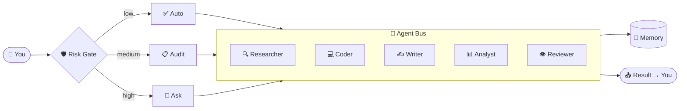

<div align="center">


<br/>

<!-- Animated typing SVG -->


<br/><br/>

[](https://github.com/Omkar0612/nexus-ai/actions/workflows/ci.yml)
[](https://github.com/Omkar0612/nexus-ai/stargazers)
[](https://github.com/Omkar0612/nexus-ai/network/members)
[](https://go.dev)
[](LICENSE)
[](CONTRIBUTING.md)
[](https://github.com/Omkar0612/nexus-ai)

<br/>

> **I analysed 500+ Reddit complaints about AI agents and built a fix for every single one.**

<br/>

[🚀 Quick Start](#-quick-start) · [✨ Features](#-features) · [🆓 Free LLMs](#-free-llm-providers) · [📺 Demo](#-demo) · [📋 Changelog](#-changelog) · [🤝 Contribute](#-built-by-the-community)

</div>

---

## 🚀 Quick Start

```bash
# 1. Clone & build
git clone https://github.com/Omkar0612/nexus-ai
cd nexus-ai && make build

# 2. Add your free API key (console.groq.com — 60 sec signup)
cp config/nexus.example.toml ~/.nexus/nexus.toml

# 3. Run
nexus start
nexus chat
```

> 🆓 **No paid API needed.** Works with Groq (free), Gemini (free), Ollama (local), OpenRouter (free tier).

<details>
<summary><b>🐳 Full cluster (Docker) &rarr;</b></summary>

```bash
docker compose up -d
# 3 load-balanced nodes + Ollama + n8n
# Health checks every 10s. Dead nodes auto-removed.
```

</details>

<details>
<summary><b>📱 Telegram companion &rarr;</b></summary>

```toml
# ~/.nexus/nexus.toml
[telegram]
token            = "your-bot-token"
allowed_user_ids = [your-telegram-id]
admin_chat_id    = your-telegram-id
```

```bash
nexus telegram start
```

```
/chat    — talk to NEXUS from anywhere
/drift   — what's stalled right now
/digest  — your morning brief
/approve — approve a high-risk action
/vault   — retrieve a secret
```

</details>

---

## 📺 Demo

```
╔══════════════════════════════════════════════════════════════╗
║                                                              ║
║  $ nexus chat                                                ║
║                                                              ║
║  > research YC 2026 AI startups, analyse their pricing,      ║
║    write a competitive brief, save as report.md              ║
║                                                              ║
╠══════════════════════════════════════════════════════════════╣
║                                                              ║
║  🔍  Researcher  ──▶  fetching 14 YC profiles       [done]  ║
║  📊  Analyst     ──▶  comparing pricing tiers       [done]  ║
║  ✍️   Writer      ──▶  drafting executive summary   [done]  ║
║  💾  File Agent  ──▶  writing report.md             [done]  ║
║                                                              ║
╠══════════════════════════════════════════════════════════════╣
║  ✅  Done in 47 seconds.  Cost: $0.00                        ║
╚══════════════════════════════════════════════════════════════╝
```

```
╔═══════════════════════════════════╗
║  🌅  Good morning, Omkar.         ║
║                                   ║
║  📈  Goals on track    3 / 4      ║
║  ⚠️   Stalled tasks      1        ║
║  💰  LLM cost today    $0.00      ║
║  📚  New KB entries     2         ║
║  📧  Unread emails      5         ║
╚═══════════════════════════════════╝

  💡 "nexus-api-refactor" stalled 2 days.
     Resume or close it?
```

---

## ✨ Features

<div align="center">

</div>

<br/>

### 🔍 Drift Detector
> *The only AI agent that notices when your own work is stalling.*

Runs silently in the background. Monitors your conversation history for stalled tasks, missed follow-ups, and repetitive failures. Fires smart nudges — not spam.

```
🔴 [HIGH]   'nexus-api-refactor' stalled — last touched 2 days ago
             💡 Resume or close this task?

🟡 [MEDIUM] Follow-up missed — 'ping client about invoice' (3 days ago)
             💡 Did you follow up?

🔴 [HIGH]   Same error mentioned 3× — 'connection refused'
             💡 Let me help you solve this systematically
```

---

### 🏥 Self-Healing Engine
> *Fails once. Never twice.*

When a task fails, NEXUS diagnoses the root cause, switches to a backup LLM provider, and retries — all without you touching a thing.

```
⚠️  Task 'daily-briefing' failed (attempt 1/3)
    ROOT CAUSE: Groq rate limit hit at 06:00 UTC
    FIX: Switching to Gemini 2.0 Flash...
         Retrying in 30s...
✅  Task recovered successfully.
```

---

### 🛡️ Human-in-the-Loop Gate
> *Smart trust, not blind execution.*

Every action is risk-scored before execution. Low risk runs silently. Medium risk is logged. High risk — NEXUS asks you first.

| Risk Level | Actions | Behaviour |
|:---:|:---|:---|
| 🟢 Low | Read file, Search web, Chat | Silent execute |
| 🟡 Medium | Write file, Send message | Execute + audit log |
| 🔴 High | Delete data, Push to GitHub, Make call | Pause → ask you |

---

### 🧠 Memory & Knowledge Base
> *Remembers everything. Forgets nothing.*

- **Episodic memory** — full conversation history in local SQLite
- **Knowledge base** — ingest docs, PDFs, URLs → semantic search
- **Working memory** — in-session context window management
- **Privacy Vault** — AES-256-GCM encrypted secrets, never sent to an LLM

---

### 🤖 Multi-Agent Bus
> *The right agent for every job.*

NEXUS automatically decomposes your request and routes it across specialised agents in parallel:



---

### 🎭 Emotional Intelligence
> *Talks to you like a person, not a robot.*

Detects frustration, urgency, or stress in your messages and adjusts its tone in real-time.

```
You:    "this is STILL not working ugh"
NEXUS:  detects → frustrated + stressed
        responds → empathetic, direct, solution-first
        "Here's the exact fix: [answer]"
        (no preamble, no filler)
```

---

### 🎤 Voice Interface
> *Fully offline. No cloud. No subscription.*

OpenAI Whisper runs locally for speech-to-text. Local TTS for responses. Works on a plane.

```bash
nexus voice start
# 🎤 Listening...
# "schedule a briefing for tomorrow morning"
# ✅ Scheduled: daily-briefing at 07:00
```

---

### 📴 Offline Mode
> *Loses internet. Keeps working.*

Detects connectivity loss. Switches to local Ollama. Queues outbound tasks. Syncs everything when you're back online.

---

### 🌐 Integrations

<div align="center">

| Integration | What NEXUS can do |
|:---:|:---|
| 📧 **Email** (IMAP/SMTP) | Read, classify, summarise, reply |
| 🐙 **GitHub** | Create issues, open PRs, review code — HITL on destructive ops |
| 📞 **Phone** (Twilio) | Call or SMS on your behalf |
| 📱 **Telegram** | Full remote control from your phone |
| 🌐 **Browser** | Fetch and read any webpage, inject into context |
| ⚙️ **n8n** | Trigger any n8n workflow as a NEXUS skill |
| 📝 **Notes** | Capture, search, export meeting notes |
| 📊 **Dashboard** | Live analytics at `localhost:7700` |

</div>

---

## 🆓 Free LLM Providers

<div align="center">

| Provider | Model | Speed | Daily Limit | Cost |
|:---:|:---:|:---:|:---:|:---:|
|  | Llama 3.3 70B | ⚡ 300 tok/s | Unlimited |  |
|  | 2.0 Flash | ⚡ Fast | 1M tokens/day |  |
|  | Any model | 🖥️ Local | Unlimited |  |
|  | Multiple | ⚡ Fast | Free tier |  |
|  | Multiple | ⚡ Fast | $25 credits |  |

</div>

---

## ⚔️ NEXUS vs The World

<div align="center">

| Capability | NEXUS | AutoGPT | CrewAI | n8n AI | LangChain |
|:---|:---:|:---:|:---:|:---:|:---:|
| Fixes its own failures | ✅ | ❌ | ❌ | ❌ | ❌ |
| Detects stalled work | ✅ | ❌ | ❌ | ❌ | ❌ |
| Risk gate before every action | ✅ | ⚠️ | ⚠️ | ⚠️ | ❌ |
| Works fully offline | ✅ | ❌ | ❌ | ❌ | ❌ |
| AES-256 local secrets vault | ✅ | ❌ | ❌ | ❌ | ❌ |
| Reads your email | ✅ | ❌ | ⚠️ | ⚠️ | ❌ |
| Calls your phone | ✅ | ❌ | ❌ | ⚠️ | ❌ |
| Reads your tone | ✅ | ❌ | ❌ | ❌ | ❌ |
| 3-node load-balanced cluster | ✅ | ❌ | ❌ | ✅ | ❌ |
| Morning briefing | ✅ | ❌ | ❌ | ❌ | ❌ |
| 100% free to run | ✅ | ⚠️ | ⚠️ | ⚠️ | ⚠️ |
| Written in Go (fast + single binary) | ✅ | ❌ | ❌ | ❌ | ❌ |

</div>

---

## 📋 Changelog

<details open>
<summary><b>v1.4 — Analytics · Phone · Email · Notes · GitHub Agent</b> &nbsp;🆕</summary>

<br/>

- 📊 **Analytics Dashboard** — live cost, agent activity, goal progress at `localhost:7700`
- 📞 **Phone Agent** — call or SMS via Twilio with HITL confirmation
- 📧 **Email Agent** — read, classify, summarise and reply via IMAP/SMTP
- 📝 **Notes Agent** — capture, tag, search and export meeting notes
- 🐙 **GitHub Agent** — issues, PRs, branches; HITL gate on all destructive ops
- 📱 **Telegram Companion** — full remote control from your phone
- 🐛 **Hallucination Detector** — cross-checks LLM outputs before presenting results
- 🔁 **Loop Detector** — breaks infinite agent loops automatically
- 🧠 **Adaptive Learner** — personalises prompts based on your interaction patterns

</details>

<details>
<summary><b>v1.3 — Multi-Agent Bus · Daily Digest · Voice · Browser</b></summary>

<br/>

- 🤖 **Multi-Agent Bus** — Researcher, Coder, Writer, Analyst, Reviewer working in parallel
- 🌅 **Daily Digest** — automated morning briefing with goals, drift, and cost summary
- 🛡️ **HITL Gate** — risk-scored approval gate before every action
- 🎤 **Voice Interface** — offline Whisper STT + local TTS
- 🌐 **Browser Agent** — fetch and read any URL, inject into context

</details>

<details>
<summary><b>v1.0–1.2 — Core Intelligence</b></summary>

<br/>

- 🔍 **Drift Detector** — stalled tasks, missed follow-ups, repetitive failures
- 🏥 **Self-Healing** — auto-retry with LLM provider switching
- 🎭 **Emotional Intelligence** — tone detection + adaptive responses
- 🎯 **Goal Tracker** — persistent goals with deviation warnings
- 📬 **Session Briefing** — smart catch-up when you return after absence
- 🔐 **Privacy Vault** — AES-256-GCM local secrets manager
- 🎭 **Persona Engine** — Work / Focus / Client / Research modes
- 📴 **Offline Mode** — local Ollama fallback + task queue
- ⚖️ **Load Balancer** — 3-node cluster with health checks and auto-failover

</details>

<details>
<summary><b>🔮 Roadmap — v1.5+</b></summary>

<br/>

- [ ] 🧩 **Plugin SDK** — write your own NEXUS skills in Go or Python
- [ ] 🗓️ **Calendar Agent** — Google Calendar + Outlook integration
- [ ] 🖼️ **Vision Agent** — analyse screenshots and images in context
- [ ] 💬 **Slack / Discord** — additional companion channels
- [ ] 🔎 **Semantic Memory Search** — vector embeddings for long-term recall
- [ ] 📦 **Homebrew + apt install** — one-line install on any machine

</details>

---

## 🤝 Built by the Community

```bash
git clone https://github.com/Omkar0612/nexus-ai
# Pick an issue labelled 'good first issue'
# Build a new skill (browser, phone, email are great examples)
# Open a PR
```

See [CONTRIBUTING.md](CONTRIBUTING.md) · Most wanted: **new skills · free API integrations · use-case examples**

---

<div align="center">

[](https://star-history.com/#Omkar0612/nexus-ai)

<br/>


<br/>


</div>
