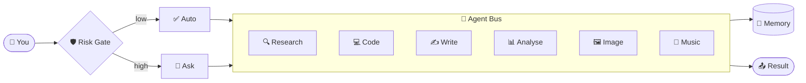

<div align="center">


<br/>


<br/><br/>

[](https://github.com/Omkar0612/nexus-ai/actions/workflows/ci.yml)
[](https://github.com/Omkar0612/nexus-ai/stargazers)
[](https://github.com/Omkar0612/nexus-ai/network/members)
[](https://go.dev)
[](LICENSE)
[](CONTRIBUTING.md)
[](https://github.com/Omkar0612/nexus-ai)

<br/>

> **I analysed 500+ Reddit complaints about AI agents and built a fix for every single one.**

<br/>

[🚀 Quick Start](#-quick-start) · [✨ Features](#-features) · [🌐 Web UI](#-web-ui--v16) · [🎨 v1.7 Studio](#-v17-creative-studio) · [🆓 Free LLMs](#-free-llm-providers) · [📋 Changelog](#-changelog) · [🔮 Roadmap](ROADMAP.md)

</div>

---

## 🚀 Quick Start

```bash
# 1. Clone & build
git clone https://github.com/Omkar0612/nexus-ai
cd nexus-ai
CGO_ENABLED=1 go build -tags ci ./...

# 2. Add your free API key (console.groq.com — 60 sec signup)
cp config/nexus.example.toml ~/.nexus/nexus.toml

# 3. Run — Web UI at http://localhost:7070
nexus start
```

> 🆓 **No paid API needed.** Works with Groq (free), Gemini (free), Ollama (local), OpenRouter (free tier).

<details>
<summary><b>🌐 Web UI flags &rarr;</b></summary>

```bash
nexus start                        # Web UI at :7070 (default)
nexus start --webui-addr :8080     # Custom port
nexus start --no-webui             # CLI only
nexus start --debug                # Verbose logging
```

</details>

<details>
<summary><b>🎨 Image generation (v1.7) &rarr;</b></summary>

```bash
# Local Stable Diffusion (Automatic1111 running at :7860)
nexus imagine "a futuristic Dubai skyline at sunset, cinematic"

# Together AI free credits (FLUX.1-schnell)
nexus imagine --backend together "logo for a tech startup, minimalist"

# Output to file
nexus imagine --output ./out.png "abstract neon waves"
```

</details>

<details>
<summary><b>🔊 Voice synthesis (v1.7) &rarr;</b></summary>

```bash
# System TTS (always free, no setup)
nexus speak "Good morning, your briefing is ready"

# Coqui TTS local server (http://localhost:5002)
nexus speak --backend coqui --out briefing.wav "3 tasks today"

# ElevenLabs free tier (10k chars/month)
nexus speak --backend elevenlabs "Meeting in 10 minutes"
```

</details>

<details>
<summary><b>✍️ Writing Studio (v1.7) &rarr;</b></summary>

```bash
# Draft a blog post
nexus write draft --topic "AI agents in 2026" --style professional --words 500

# Proofread a file
nexus write proofread --file report.md

# Summarise to 100 words
nexus write summarise --file meeting-notes.txt --words 100

# Rewrite in casual tone
nexus write rewrite --style casual --file email-draft.txt

# Translate to Arabic
nexus write translate --lang Arabic --file announcement.txt
```

</details>

<details>
<summary><b>🎵 Music generation (v1.7) &rarr;</b></summary>

```bash
# Local AudioCraft (Meta's free model)
nexus music "upbeat lo-fi hip hop, 90 bpm" --duration 30s --out track.wav

# Replicate API (free tier)
nexus music --backend replicate "cinematic orchestral swell" --duration 15s
```

</details>

<details>
<summary><b>📅 Calendar agent (v1.5) &rarr;</b></summary>

```bash
# Today's schedule
nexus calendar today

# Check conflicts this week
nexus calendar conflicts --week

# Find next free 1-hour slot
nexus calendar free --duration 1h

# Morning digest
nexus calendar digest
```

</details>

<details>
<summary><b>🔌 Plugin SDK (v1.5) &rarr;</b></summary>

```go
// Create a custom skill in 5 lines
skill := plugin.NewSkill("weather", "Get current weather", func(in plugin.Input) plugin.Output {
    return plugin.Output{Text: fetchWeather(in.Args["city"])}
})
nexus.Registry.Register(skill)
```

```bash
nexus skills list          # List all registered plugins
nexus skills run weather city=Dubai
```

</details>

<details>
<summary><b>🐳 Docker cluster &rarr;</b></summary>

```bash
docker compose up -d
# 3 load-balanced nodes + Ollama + n8n
```

</details>

---

## 🌐 Web UI — v1.6

```
┌─────────────────────────────────────────────────────────────────┐
│  NEXUS AI  v1.7                              ● agents: 3 active │
├─────────────────────────────────────────────────────────────────┤
│  ┌──────────────────────────────────────────────────────────┐   │
│  │  You: generate an image of Dubai skyline at sunset       │   │
│  │  NEXUS: ✅ Image saved → ./output/dubai-sunset.png       │   │
│  │                                               (done)     │   │
│  └──────────────────────────────────────────────────────────┘   │
│  📡 Agent Activity                                               │
│  ● imagegen   running   — Stable Diffusion generating...         │
│  ✓ writer     done      — caption generated                      │
│  [ Type a message...                              ] [ Send ▶ ]  │
└─────────────────────────────────────────────────────────────────┘
```

| Method | Endpoint | Description |
|:---:|:---|:---|
| `POST` | `/api/chat` | Stream LLM response as SSE |
| `GET` | `/api/events` | Live agent activity stream |
| `GET` | `/api/health` | `{"status":"ok","version":"1.7"}` |
| `GET` | `/` | Embedded dark-mode UI |

---

## 🎨 v1.7 Creative Studio

> *Replace Midjourney · ElevenLabs · Grammarly · Suno · ChatGPT — for free.*

### 🖼️ Image Generation

```bash
# 1. Local Stable Diffusion (Automatic1111 at localhost:7860) — fully free, fully private
nexus imagine "minimalist logo, purple gradient, tech startup"
# ✅ Saved: output/nexus-1709123456.png  (4.2s)

# 2. Together AI FLUX.1-schnell — free $25 credits (~500 images)
nexus imagine --backend together --width 1024 --height 768 \
  "Dubai Marina at golden hour, photorealistic, 8K"
```

### 🔊 Voice Synthesis

```bash
# Coqui TTS — 100% local, 30+ voices, no API key
curl -s http://localhost:5002/api/tts?text=Hello > hello.wav

# ElevenLabs — 10,000 chars/month FREE
nexus speak --backend elevenlabs \
  "Your daily briefing: 3 tasks, 2 meetings, cost $0.00"

# System TTS — always works, zero setup
nexus speak "Reminder: standup in 5 minutes"
```

### ✍️ Writing Studio

```bash
# Full writing pipeline — draft → proofread → translate
nexus write draft --topic "Why AI agents beat SaaS tools" \
  --style persuasive --words 800 --out article.md

nexus write proofread --file article.md
# CORRECTED: ...
# ISSUE: Comma splice in paragraph 3
# ISSUE: Passive voice in conclusion

nexus write translate --lang Arabic --file article.md --out article-ar.md
```

### 🎵 Music Generation

```bash
# Meta AudioCraft (local, free) — requires Python bridge
nexus music "calm lo-fi piano for focus work" --duration 60s --out focus.wav

# Replicate MusicGen (free tier)
nexus music --backend replicate \
  "epic cinematic intro, orchestral, rising tension" --duration 20s
```

---

## 📺 Demo

```
╔══════════════════════════════════════════════════════════════╗
║  $ nexus start                                               ║
║    NEXUS AI v1.7  •  Web UI: http://localhost:7070           ║
╠══════════════════════════════════════════════════════════════╣
║  $ nexus imagine "YC startup pitch deck cover, minimalist"   ║
║  🖼️  Generating via Stable Diffusion...                      ║
║  ✅  Saved: output/pitch-cover.png  (3.8s, $0.00)           ║
╠══════════════════════════════════════════════════════════════╣
║  $ nexus write draft --topic "AI trends 2026" --words 600    ║
║  ✍️  Drafting via Groq Llama 3.3 70B...                      ║
║  ✅  Saved: output/ai-trends.md  (2.1s, $0.00)              ║
╠══════════════════════════════════════════════════════════════╣
║  $ nexus speak "Article ready for review"                    ║
║  🔊  Speaking via system TTS...  ✅  Done                    ║
╠══════════════════════════════════════════════════════════════╣
║  $ nexus calendar today                                      ║
║  🕐  09:00 — 10:00  Standup                                  ║
║  🕐  14:00 — 15:30  Client call — 👥 client@example.com     ║
║  ⚠️  CONFLICT: Standup overlaps with Focus Block (30 min)    ║
╠══════════════════════════════════════════════════════════════╣
║  Total cost today: $0.00                                     ║
╚══════════════════════════════════════════════════════════════╝
```

---

## ✨ Features

### 🔍 Drift Detector
> *The only AI agent that notices when your work is stalling.*

```
🔴 [HIGH]   'nexus-api-refactor' stalled — last touched 2 days ago
🟡 [MEDIUM] Follow-up missed — 'ping client about invoice' (3 days)
🔴 [HIGH]   Same error 3× — 'connection refused' → Let me fix this
```

### 🏥 Self-Healing Engine
> *Fails once. Never twice.*

```
⚠️  Task 'daily-briefing' failed — Groq rate limit
    Switching to Gemini 2.0 Flash... Retrying in 30s...
✅  Task recovered. Cost: $0.00
```

### 🛡️ Human-in-the-Loop Gate

| Risk | Examples | Behaviour |
|:---:|:---|:---|
| 🟢 Low | Read, Search, Chat | Silent execute |
| 🟡 Medium | Write file, Send message | Execute + log |
| 🔴 High | Delete, Push to GitHub, Call | Pause → ask |

### 🧠 Memory & Semantic Search
- **Episodic** — SQLite conversation history
- **Semantic** — TF-IDF cosine similarity search (zero deps)
- **Vault** — AES-256-GCM encrypted local secrets

### 🤖 Multi-Agent Bus



### 🌐 Integrations

| Integration | Capability |
|:---:|:---|
| 🌐 **Web UI** | Live chat + SSE agent feed at `localhost:7070` |
| 🖼️ **Image Gen** | Stable Diffusion (local) · FLUX via Together AI |
| 🔊 **Voice TTS** | Coqui (local) · ElevenLabs (10k/mo free) · System |
| ✍️ **Writing** | Draft · Rewrite · Proofread · Translate |
| 🎵 **Music** | AudioCraft (local) · MusicGen via Replicate |
| 📅 **Calendar** | Google Calendar (free) · ICS files |
| 🔌 **Plugins** | Custom skills via SDK, `NewSkill()` in 5 lines |
| 📧 **Email** | IMAP/SMTP read, classify, summarise, reply |
| 🐙 **GitHub** | Issues, PRs, code review with HITL gate |
| 📞 **Phone** | Call / SMS via Twilio |
| 📱 **Telegram** | Full remote control from your phone |
| 📊 **Dashboard** | Live analytics at `localhost:7700` |

---

## 🆓 Free LLM Providers

| Provider | Model | Speed | Limit | Cost |
|:---:|:---:|:---:|:---:|:---:|
|  | Llama 3.3 70B | ⚡ 300 tok/s | Unlimited | Free |
|  | 2.0 Flash | ⚡ Fast | 1M tok/day | Free |
|  | Any model | 🖥️ Local | Unlimited | Free |
|  | Multiple | ⚡ Fast | Free tier | Free |
|  | FLUX/Multiple | ⚡ Fast | $25 credits | Free |

---

## ⚔️ NEXUS vs The World

| Capability | NEXUS | AutoGPT | CrewAI | n8n AI | LangChain |
|:---|:---:|:---:|:---:|:---:|:---:|
| Self-healing failures | ✅ | ❌ | ❌ | ❌ | ❌ |
| Drift detection | ✅ | ❌ | ❌ | ❌ | ❌ |
| Risk gate (HITL) | ✅ | ⚠️ | ⚠️ | ⚠️ | ❌ |
| Offline mode | ✅ | ❌ | ❌ | ❌ | ❌ |
| AES-256 secrets vault | ✅ | ❌ | ❌ | ❌ | ❌ |
| Web UI (embedded) | ✅ | ❌ | ❌ | ✅ | ❌ |
| Image generation | ✅ | ❌ | ❌ | ⚠️ | ❌ |
| Voice synthesis | ✅ | ❌ | ❌ | ❌ | ❌ |
| AI writing studio | ✅ | ❌ | ❌ | ❌ | ❌ |
| Music generation | ✅ | ❌ | ❌ | ❌ | ❌ |
| Calendar agent | ✅ | ❌ | ❌ | ⚠️ | ❌ |
| Plugin SDK | ✅ | ⚠️ | ✅ | ✅ | ✅ |
| Email / Phone / Telegram | ✅ | ❌ | ❌ | ⚠️ | ❌ |
| Single binary, Go | ✅ | ❌ | ❌ | ❌ | ❌ |
| 100% free to run | ✅ | ⚠️ | ⚠️ | ⚠️ | ⚠️ |

---

## 🔮 Roadmap — Replacing $289/mo of paid tools

```
v1.5  ████████████████████ 100%  ✅ Calendar · Vision · Semantic Search · Plugin SDK · Google Cal
v1.6  ████████████████████ 100%  ✅ Web UI · SSE · Desktop Scaffold · CI hardened
v1.7  ██████████░░░░░░░░░░  50%  🔨 Image Gen · Voice TTS · Writing Studio · Music (scaffolded)
v1.8  ░░░░░░░░░░░░░░░░░░░░   0%  Code Copilot (LSP) · DevOps Agent · Code Search
v1.9  ░░░░░░░░░░░░░░░░░░░░   0%  Finance · Health · CRM · Learning · Travel Agents
v2.0  ░░░░░░░░░░░░░░░░░░░░   0%  NEXUS OS — AI layer for everything
```

**[📖 Read the full ROADMAP →](ROADMAP.md)**

---

## 📋 Changelog

<details open>
<summary><b>v1.7 — Image Gen · Voice TTS · Writing Studio · Music</b> &nbsp;🆕 (in progress)</summary>

<br/>

- 🖼️ **Image Generation** — Stable Diffusion (local A1111) + Together AI FLUX.1-schnell (free credits); save to PNG
- 🔊 **Voice Synthesis** — Coqui TTS (local) + ElevenLabs free tier (10k chars/mo) + system `say`/`espeak` fallback
- ✍️ **Writing Studio** — Draft, Rewrite, Summarise, Proofread, Expand, Translate (backed by LLM router, $0 cost)
- 🎵 **Music Generation** — Meta AudioCraft bridge (local) + Replicate MusicGen (free tier); silent-WAV stub for CI
- 🧪 **Tests** — `imagegen_test.go` (httptest SD mock), `music_test.go` (stub WAV validation)

</details>

<details>
<summary><b>v1.5 — Calendar · Vision · Semantic Search · Plugin SDK</b> &nbsp;✅ complete</summary>

<br/>

- 📅 **Calendar Agent** — `Today()`, `Week()`, `FindFreeSlot()`, `DetectConflicts()`, `DigestLines()`, Google Calendar OAuth2 provider
- 👁️ **Vision Agent** — describe images, extract text (OCR), detect objects via local LLaVA (Ollama) or Together AI
- 🧠 **Semantic Search** — TF-IDF cosine similarity index, zero external deps, `Add()` → `Rebuild()` → `Search(query, topK)`
- 🔌 **Plugin SDK** — `Plugin` interface + `NewSkill()` helper + `Registry` with `Register()`, `Execute()`, `List()`
- 🗂️ **Google Calendar provider** — full `ListEvents()`, `CreateEvent()`, `UpdateEvent()`, `DeleteEvent()` against REST API
- 🧪 **Tests** — `semantic_test.go`, `plugin_test.go`, calendar conflict detection

</details>

<details>
<summary><b>v1.6 — Web UI · Desktop Scaffold · CI Hardening</b> &nbsp;✅ complete</summary>

<br/>

- 🌐 **Web UI** — dark-mode chat, `//go:embed`, zero JS frameworks, SSE streaming
- 📡 **SSE Agent Bus** — `GET /api/events` broadcasts live agent state changes
- 🖥️ **Desktop** — system tray + hotkey (`Ctrl+Shift+Space`) + clipboard stub (v1.7)
- 🏗️ **CI** — `-tags ci` build, desktop no-op stub, clean dep chain (no broken proxy entries)

</details>

<details>
<summary><b>v1.4 — Analytics · Phone · Email · Notes · GitHub Agent</b></summary>

<br/>

- 📊 Analytics Dashboard · 📞 Phone Agent · 📧 Email Agent · 📝 Notes Agent
- 🐙 GitHub Agent · 📱 Telegram Companion
- 🐛 Hallucination Detector · 🔁 Loop Detector · 🧠 Adaptive Learner

</details>

<details>
<summary><b>v1.0–1.3 — Core Intelligence</b></summary>

<br/>

- 🔍 Drift Detector · 🏥 Self-Healing · 🎭 Emotional Intelligence
- 🎯 Goal Tracker · 🔐 Privacy Vault · 📴 Offline Mode · ⚖️ Load Balancer
- 🤖 Multi-Agent Bus · 🌅 Daily Digest · 🎤 Voice Interface · 🌐 Browser Agent

</details>

---

## 🤝 Built by the Community

```bash
git clone https://github.com/Omkar0612/nexus-ai
# Pick 'good first issue' → build a skill → open a PR
```

See [CONTRIBUTING.md](CONTRIBUTING.md) · Most wanted: **new skills · free API integrations · use-case examples**

---

<div align="center">

[](https://star-history.com/#Omkar0612/nexus-ai)

<br/>


<br/>


</div>
