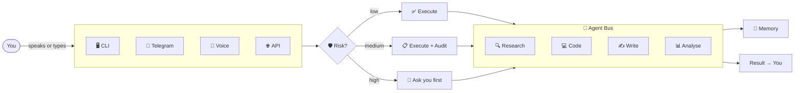

<div align="center">


<br/>

[](https://github.com/Omkar0612/nexus-ai/actions/workflows/ci.yml)
[](https://github.com/Omkar0612/nexus-ai/stargazers)
[](https://go.dev)
[](LICENSE)
[](https://github.com/Omkar0612/nexus-ai)

<br/>

</div>

---

<div align="center">

# Most AI agents don't work.
### We fixed that.

</div>

---

<div align="center">

```bash
git clone https://github.com/Omkar0612/nexus-ai
cd nexus-ai && make build
nexus start
```

**That's it. You're running.**

</div>

---

<br/>

<div align="center">

## The problems. The fixes.

</div>

<br/>

```
╭───────────────────────────────────────────────────────────────╮
│                                                               │
│  “The agent forgot what it was doing.”                        │
│                                                               │
│  ✔  NEXUS has a Drift Detector.                               │
│     It notices stalled work before you do.                    │
│                                                               │
╯───────────────────────────────────────────────────────────────╯

╭───────────────────────────────────────────────────────────────╮
│                                                               │
│  “It failed. Again. With no explanation.”                     │
│                                                               │
│  ✔  NEXUS is Self-Healing.                                    │
│     Diagnoses the cause. Switches providers. Retries.         │
│                                                               │
╯───────────────────────────────────────────────────────────────╯

╭───────────────────────────────────────────────────────────────╮
│                                                               │
│  “I can't trust it. I don't know what it did or why.”        │
│                                                               │
│  ✔  NEXUS has a Human-in-the-Loop Gate.                       │
│     Low risk: silent. Medium: audited. High: asks you first.  │
│                                                               │
╯───────────────────────────────────────────────────────────────╯

╭───────────────────────────────────────────────────────────────╮
│                                                               │
│  “I lose internet. Everything stops.”                        │
│                                                               │
│  ✔  NEXUS works Offline.                                      │
│     Switches to local Ollama. Queues tasks. Syncs when back.  │
│                                                               │
╯───────────────────────────────────────────────────────────────╯

╭───────────────────────────────────────────────────────────────╮
│                                                               │
│  “It costs $200/month and I need 3 paid APIs.”               │
│                                                               │
│  ✔  NEXUS costs nothing.                                      │
│     Groq, Gemini, Ollama, OpenRouter — all free.              │
│                                                               │
╯───────────────────────────────────────────────────────────────╯
```

---

<br/>

<div align="center">

## One command. Four agents. 47 seconds.

</div>

```
╔═════════════════════════════════════════════════════════════╗
║                                                             ║
║  > research YC 2026 AI startups, analyze their pricing,     ║
║    write a competitive analysis, save as report.md           ║
║                                                             ║
╠═════════════════════════════════════════════════════════════╣
║                                                             ║
║  🔍  Researcher  ──▶  fetching data                       ║
║  📊  Analyst     ──▶  comparing pricing                   ║
║  ✍️   Writer      ──▶  drafting analysis                   ║
║  💾  File Agent  ──▶  saving report.md                    ║
║                                                             ║
╠═════════════════════════════════════════════════════════════╣
║  ✅  Done in 47 seconds.                                    ║
╚═════════════════════════════════════════════════════════════╝
```

<div align="center">

NEXUS routes across **Researcher · Analyst · Writer · Coder · Reviewer** automatically.
You just describe what you want.

</div>

---

<br/>

<div align="center">

## It knows what you need before you ask.

</div>

```
╔══════════════════════════════════╗
║  🌅  Good morning.               ║
║                                ║
║  📈  Goals on track    3 / 4    ║
║  ⚠️   Stalled task       1       ║
║  💰  LLM cost today    $0.00    ║
║  📚  New KB docs        2       ║
╚══════════════════════════════════╝
```

<div align="center">

Every morning. Automatically. Before you open your laptop.

</div>

---

<br/>

<div align="center">

## How it thinks.

</div>



---

<br/>

<div align="center">

## Everything it can do.

</div>

<br/>

<div align="center">

| | Feature | What it does |
|:---:|:---|:---|
| 🔍 | **Drift Detector** | Notices stalled work before you do |
| 🏥 | **Self-Healing** | Diagnoses failures, switches LLMs, retries |
| 🎭 | **Emotional Intelligence** | Reads your tone. Responds accordingly |
| 🎯 | **Goal Tracking** | Warns when you're going off track |
| 🔐 | **Privacy Vault** | AES-256 secrets. Never touches an LLM |
| 📴 | **Offline Mode** | Works without internet. Syncs when back |
| 🎭 | **Persona Engine** | Work / Focus / Client / Research modes |
| 📬 | **Session Briefing** | Catches you up when you return |
| 🤖 | **Multi-Agent Bus** | Researcher, Coder, Writer, Analyst, Reviewer |
| 🛡️ | **HITL Gate** | Low/Medium/High risk classification per action |
| 🎤 | **Voice Interface** | Offline Whisper → TTS. Fully local |
| 🌐 | **Browser Agent** | Reads the web. Injects into context |
| 🌅 | **Daily Digest** | Morning briefing. Goals. Drift. Cost |
| 📊 | **Analytics Dashboard** | Cost, agents, goals at localhost:7700 |
| 📞 | **Phone Agent** | Call or SMS via Twilio |
| 📧 | **Email Agent** | Read, classify, reply via IMAP/SMTP |
| 📝 | **Notes Agent** | Capture, search, export meeting notes |
| 🐙 | **GitHub Agent** | Issues, PRs, branches — HITL on destructive ops |
| 📱 | **Telegram Companion** | Full control from your phone |
| ⚖️ | **Load Balanced Cluster** | 3 nodes. Auto-failover. One command |

</div>

---

<br/>

<div align="center">

## The only agent that costs nothing.

</div>

<br/>

<div align="center">

| Provider | Model | Cost |
|:---:|:---:|:---:|
| **Groq** | Llama 3.3 70B · 300 tok/s |  |
| **Gemini** | 2.0 Flash · 1M tok/day |  |
| **Ollama** | Any model · local |  |
| **OpenRouter** | Multiple models |  |

</div>

---

<br/>

<div align="center">

## Others vs NEXUS.

</div>

<br/>

<div align="center">

| | NEXUS | AutoGPT | n8n AI | OpenClaw |
|:---|:---:|:---:|:---:|:---:|
| Fixes its own failures | ✅ | ❌ | ❌ | ❌ |
| Knows when work is stalled | ✅ | ❌ | ❌ | ❌ |
| Asks before deleting your data | ✅ | ⚠️ | ⚠️ | ❌ |
| Works without the internet | ✅ | ❌ | ❌ | ❌ |
| Costs $0 to run | ✅ | ⚠️ | ⚠️ | ⚠️ |
| Reads your email | ✅ | ❌ | ⚠️ | ❌ |
| Calls your phone | ✅ | ❌ | ⚠️ | ❌ |
| Runs on 3 nodes with failover | ✅ | ❌ | ✅ | ❌ |
| Briefs you every morning | ✅ | ❌ | ❌ | ❌ |
| Reads your tone | ✅ | ❌ | ❌ | ❌ |

</div>

---

<br/>

<div align="center">

## The full setup. One command.

</div>

```bash
docker compose up -d
# 3 NEXUS nodes + load balancer + Ollama + n8n
# Health checks every 10s. Dead nodes auto-removed.
```

---

<br/>

<div align="center">

## On your phone.

</div>

<details>
<summary>&nbsp;&nbsp;<b>📱 Set up Telegram companion &rarr;</b></summary>

<br/>

```toml
# ~/.nexus/nexus.toml
[telegram]
token            = "your-bot-token"
allowed_user_ids = [your-telegram-id]
admin_chat_id    = your-telegram-id
```

```bash
nexus telegram start
```

```
/chat    — talk to NEXUS
/drift   — what’s stalled
/digest  — morning brief
/approve — approve a risky action
/vault   — get a secret
```

</details>

---

<div align="center">

## Built by the community.

See [CONTRIBUTING.md](CONTRIBUTING.md)

Most wanted: new skills · free API integrations · use case examples

---

[](https://star-history.com/#Omkar0612/nexus-ai)

<br/>

*If NEXUS saved you time — a star means a lot.*

</div>

---

<div align="center">


**MIT — free forever.**

</div>
