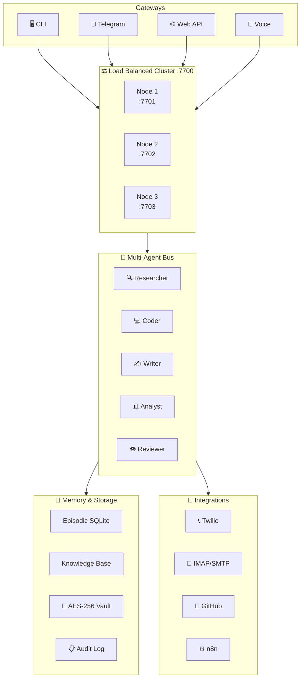

<div align="center">


[](https://github.com/Omkar0612/nexus-ai/actions/workflows/ci.yml)
[](https://github.com/Omkar0612/nexus-ai/stargazers)
[](LICENSE)
[](https://go.dev)
[](https://github.com/Omkar0612/nexus-ai)
[](CONTRIBUTING.md)

<br/>

> **I analysed 500+ Reddit complaints about AI agents and built fixes for every single one.**

<br/>

</div>

---

## 🗺️ What's Inside

<div align="center">

| 🏛️ v1.0–1.2 | 🤖 v1.3 | 📊 v1.4 |
|:---|:---|:---|
| Drift Detection | Multi-Agent Bus | Analytics Dashboard |
| Self-Healing | Daily Digest | Phone Agent |
| Emotional Intelligence | HITL Gate | Email Agent |
| Goal Tracking | Voice Interface | Notes Agent |
| Session Briefing | Browser Agent | GitHub Agent |
| Privacy Vault · Persona Engine · Offline Mode · Load Balancer | | Telegram Companion |

</div>

---

## ⚡ Quick Start

```bash
# 1. Clone & build
git clone https://github.com/Omkar0612/nexus-ai
cd nexus-ai && make build

# 2. Add your free Groq key (console.groq.com)
cp config/nexus.example.toml ~/.nexus/nexus.toml

# 3. Run
nexus start
nexus chat
```

> 🆓 **No paid API needed.** Works with Groq (free), Gemini (free), Ollama (local), OpenRouter (free tier).

<details>
<summary>📱 <b>Use on your phone via Telegram (click to expand)</b></summary>

```toml
# Add to ~/.nexus/nexus.toml
[telegram]
token           = "your-bot-token"
allowed_user_ids = [your-telegram-id]
admin_chat_id   = your-telegram-id
```

```bash
nexus telegram start
# Control NEXUS from anywhere — no app install
```

</details>

---

## 🏗️ Architecture



---

## 🆓 Free LLM Providers

<div align="center">

| Provider | Model | Speed | Daily Limit |
|:---:|:---:|:---:|:---:|
|  | Llama 3.3 70B | ⚡ 300+ tok/s | Unlimited |
|  | 2.0 Flash | ⚡ Fast | 1M tokens |
|  | Any model | 🖥️ Local | Unlimited |
|  | Multiple | ⚡ Fast | Free tier |
|  | Multiple | ⚡ Fast | $25 credits |

</div>

---

## 🧠 Core Features (v1.0–1.2)

<table>
<tr>
<td width="50%">

### 🔍 Drift Detector
```
🔴 [HIGH] 'webhook handler' stalled
         → last touched 2 days ago
💡 Resume or close this task?

🟡 [MEDIUM] Follow-up missed
           → 'ping client about invoice'
💡 Did you follow up?
```

</td>
<td width="50%">

### 🏥 Self-Healing
```
⚠️  Task 'daily-briefing' failed (1/3)
ROOT CAUSE: Groq rate limit at 06:00 UTC
FIX: Switching to Gemini Flash...
     Retrying in 30s...
✅  Task recovered successfully.
```

</td>
</tr>
<tr>
<td width="50%">

### 🎭 Emotional Intelligence
```
You:   "this is STILL not working ugh"
NEXUS: detects → frustrated + stressed
       responds → empathetic, solution-first
       "Here's the fix: [direct answer]"
```

</td>
<td width="50%">

### 🎯 Persona Engine
```bash
nexus persona use work      # code-heavy
nexus persona use focus     # ≤200 words
nexus persona use client    # professional
nexus persona use research  # deep + cited
nexus persona create mine \
  --prompt "Always use bullet points"
```

</td>
</tr>
<tr>
<td width="50%">

### 🔐 Privacy Vault
```bash
nexus vault store GROQ_KEY gsk_xxx \
  --zone business
# AES-256-GCM encrypted
# NEVER sent to any LLM
```

</td>
<td width="50%">

### 📴 Offline Mode
```bash
nexus status
# 📴 Offline (Ollama active)
#    3 tasks queued for sync
# Auto-switches on disconnect
# Auto-resumes on reconnect
```

</td>
</tr>
</table>

---

## 🤖 Multi-Agent System (v1.3)

### Agent Bus — Real Example

```
╔══════════════════════════════════════════════════════════╗
║  nexus chat                                              ║
║  > research YC 2026 startups, analyze pricing,           ║
║    write competitive analysis, save as report.md         ║
╠══════════════════════════════════════════════════════════╣
║  [1/4] 🔍 Researcher  → fetching YC 2026 batch data      ║
║  [2/4] 📊 Analyst     → comparing pricing models         ║
║  [3/4] ✍️  Writer      → drafting competitive analysis    ║
║  [4/4] 💾 File Agent  → saving report.md                 ║
╠══════════════════════════════════════════════════════════╣
║  ✅ Done in 47s                                          ║
╚══════════════════════════════════════════════════════════╝
```

**Agent roles:** `researcher` · `coder` · `writer` · `analyst` · `reviewer`

### 🛡️ Human-in-the-Loop (HITL) Gate

```
┌─────────────────────────────────────────────────────────┐
│  Risk Classification                                    │
├──────────┬────────────────────────────────────────────  │
│ 🟢 LOW   │ auto-executes silently                       │
│ 🟡 MED   │ executes + writes audit log entry            │
│ 🔴 HIGH  │ pauses → sends Telegram approval request     │
│ 🛑 LOCK  │ nexus lock → blocks ALL medium/high actions  │
└──────────┴────────────────────────────────────────────  ┘
```

### 🎤 Voice Interface
```bash
nexus voice start
# 🎤 Listening... (Whisper — fully offline)
# Speak your command → NEXUS replies via TTS
# Backends: ElevenLabs · piper (local) · silent
```

### 🌐 Browser Agent
```bash
nexus browse "extract top 10 repos from github.com/trending"
# 🌐 Navigating  → github.com/trending
# 📸 Extracting  → content scraped
# ✅ Injecting   → 10 repos into context
# 🔒 Safety: URL allowlist · depth limit · loop detection
```

### 🌅 Daily Digest
```
╔══════════════════════════════════╗
║  🌅 Good morning, Omkar          ║
║  📈 Goals on track:    3 / 4     ║
║  ⚠️  Drift signals:    1 stalled  ║
║  💰 LLM spend:         $0.00     ║
║  📚 KB highlights:     2 new     ║
╚══════════════════════════════════╝
```

---

## 📊 Analytics & Integrations (v1.4)

<table>
<tr>
<td width="50%">

### 📊 Analytics Dashboard
```bash
nexus dashboard
# → http://localhost:7700/dashboard
#
# 📈 Cost over time
# 🤖 Agent stats
# 🎯 Goal progress
# 📋 Audit trail
# 🔍 Drift history
```

</td>
<td width="50%">

### 📞 Phone Agent
```bash
nexus phone call +971xxxxxxx \
  --message "Meeting in 10 minutes"
nexus phone sms +971xxxxxxx \
  --message "report.md saved ✅"
# Inbound → NEXUS voice pipeline
```

</td>
</tr>
<tr>
<td width="50%">

### 📧 Email Agent
```bash
nexus email read       # classify inbox
nexus email reply 42   # LLM draft + send
nexus email rules      # auto-responders
# 🔒 Secrets redacted before LLM
```

</td>
<td width="50%">

### 📝 Notes Agent
```bash
nexus notes capture    # voice/text → notes
nexus notes search "Q2 strategy"
nexus notes export meeting-2026 \
  --format markdown
# ✅ Action items auto-extracted
```

</td>
</tr>
<tr>
<td width="50%">

### 🐙 GitHub Agent
```bash
nexus github issue create \
  --repo myorg/repo \
  --title "Bug: login fails"
nexus github pr review 42
# ⚠️ Destructive ops → HITL approval
```

</td>
<td width="50%">

### 📱 Telegram Companion
```
/chat    → chat with NEXUS
/drift   → stalled task check
/digest  → morning briefing
/vault   → retrieve secrets
/approve → approve high-risk actions
+ inline keyboard + voice messages
```

</td>
</tr>
</table>

---

## 📊 NEXUS vs The Competition

<div align="center">

| Feature | NEXUS | OpenClaw | n8n AI | AutoGPT |
|:---|:---:|:---:|:---:|:---:|
| 🔍 Drift Detection | ✅ | ❌ | ❌ | ❌ |
| 🏥 Self-Healing | ✅ | ❌ | ❌ | ❌ |
| 🎭 Emotional Intelligence | ✅ | ❌ | ❌ | ❌ |
| 🎯 Goal Tracking | ✅ | ❌ | ❌ | ⚠️ |
| 🔐 Privacy Vault | ✅ | ❌ | ❌ | ❌ |
| 📴 Offline Mode | ✅ | ❌ | ❌ | ❌ |
| 🎭 Persona Engine | ✅ | ❌ | ❌ | ❌ |
| 📬 Session Briefing | ✅ | ❌ | ❌ | ❌ |
| 🤖 Multi-Agent Bus | ✅ | ❌ | ⚠️ | ⚠️ |
| 🛡️ HITL Gate | ✅ | ❌ | ⚠️ | ⚠️ |
| 🎤 Voice Interface | ✅ | ❌ | ❌ | ❌ |
| 🌐 Browser Agent | ✅ | ❌ | ❌ | ✅ |
| 🌅 Daily Digest | ✅ | ❌ | ❌ | ❌ |
| 📊 Analytics Dashboard | ✅ | ❌ | ⚠️ | ❌ |
| 📞 Phone / SMS Agent | ✅ | ❌ | ⚠️ | ❌ |
| 📧 Email Agent | ✅ | ❌ | ⚠️ | ❌ |
| 📝 Notes Agent | ✅ | ❌ | ❌ | ❌ |
| 🐙 GitHub Agent | ✅ | ❌ | ❌ | ❌ |
| 📱 Telegram Companion | ✅ | ❌ | ❌ | ❌ |
| ⚖️ Load Balanced Cluster | ✅ | ❌ | ✅ | ❌ |
| 🆓 100% Free | ✅ | ⚠️ | ⚠️ | ⚠️ |

</div>

---

## 🐳 One-Command Cluster

```bash
docker compose up -d
```

```
┌─────────────────────────────────────────┐
│  🐳 NEXUS Docker Stack                  │
│                                         │
│  ✅ nexus-node-1   :7701                │
│  ✅ nexus-node-2   :7702                │
│  ✅ nexus-node-3   :7703                │
│  ✅ load-balancer  :7700                │
│  ✅ python-workers                      │
│  ✅ ollama                              │
│  ✅ n8n            :5678                │
│                                         │
│  Health checks every 10s               │
│  Dead nodes auto-removed               │
└─────────────────────────────────────────┘
```

---

## 🔌 Connect to Anything

```bash
# 2000+ integrations via n8n
nexus skill install n8n-bridge

# MCP Protocol (GitHub, Postgres, Slack, Maps...)
# nexus.toml:
[[mcp.servers]]
name    = "github"
command = "npx @modelcontextprotocol/server-github"

# Zero-key free APIs included:
# weather · Wikipedia · crypto · HackerNews
# currency · IP geo · dictionary · Reddit
nexus skill install free-apis
```

---

## 🤝 Contributing

See [CONTRIBUTING.md](CONTRIBUTING.md). Most wanted:
- 🔧 New skills (`.toml` + Python worker)
- 🌐 New free API integrations
- 📖 Use case examples & tutorials

---

## ⭐ Star History

<div align="center">

[](https://star-history.com/#Omkar0612/nexus-ai)

**If NEXUS saved you time — please star the repo!**

</div>

---

<div align="center">


**MIT License — free forever, use it however you want.**

</div>
