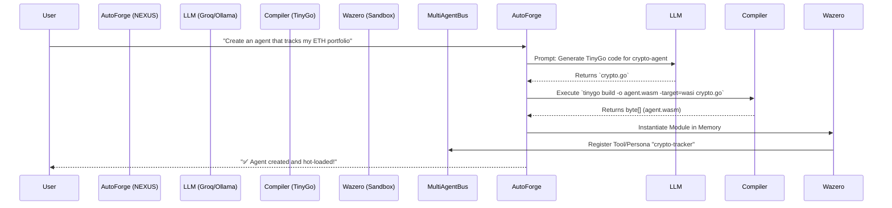

# RFC: Auto-Forge (Hot-Reloading Wasm Agents)

## 1. Overview
Unlike traditional multi-agent frameworks (like AutoAgent or LangChain) that require Python environments, Docker restarts, and filesystem modifications to spawn new agents, **NEXUS AI** will introduce **Auto-Forge**.

Auto-Forge allows users to say: *"Create a Dubai Real Estate scraping agent that checks PropertyFinder daily"* and NEXUS will autonomously generate the code, compile it to WebAssembly (Wasm), and hot-load it into the running Go binary in milliseconds. Zero restarts. Zero Docker containers. 100% sandboxed.

## 2. Why WebAssembly (wazero)?
NEXUS is built in Go. By embedding [wazero](https://wazero.io/) (a zero-dependency Wasm runtime for Go), we achieve:
1. **True Sandboxing**: Generated agents cannot access the filesystem, network, or environment variables unless explicitly granted via the NEXUS Host ABI.
2. **Hot-Reloading**: `.wasm` modules can be instantiated and discarded in memory instantly without killing the main `nexus` process.
3. **Zero Dependencies**: `wazero` requires no CGO. It keeps the NEXUS single-binary philosophy intact.

## 3. Architecture & Workflow



## 4. Core Components

### 4.1 The Host ABI (Application Binary Interface)
Since Wasm is sandboxed, the agent cannot make HTTP requests directly. It must call exported Go functions from the NEXUS Host.
```go
// Exported to Wasm module
func hostHTTPGet(urlPtr uint32, urlLen uint32) uint32 {
    // NEXUS intercepts this. 
    // Triggers HITL (Human-in-the-Loop) Risk Gate if URL is suspicious.
    // If approved, NEXUS fetches data and returns to Wasm.
}
```

### 4.2 The Auto-Forge Loop (`internal/forge/forge.go`)
1. **Spec Generation**: LLM writes the agent spec (name, description, required API permissions).
2. **Code Generation**: LLM writes pure Go code utilizing the `nexus-sdk` package.
3. **Compilation**: NEXUS invokes a local compilation toolchain (e.g., TinyGo) to generate the `.wasm` binary, or utilizes a cloud compiling endpoint if the local machine lacks the toolchain.
4. **Mounting**: NEXUS mounts the `.wasm` bytes into `wazero.Runtime`.

### 4.3 Security & HITL Integration
When an Auto-Forged agent attempts to access the AES-256 Vault or make network calls, the request hits the **HITL Gate**:
* **Read request (e.g., check coin price)**: Auto-approved.
* **Write request (e.g., buy coin, send email)**: Intercepted. NEXUS pauses the Wasm thread, prompts the user via WebUI/CLI, and resumes execution upon approval.

## 5. Implementation Roadmap

- [ ] **Phase 1**: Integrate `wazero` into `internal/plugin/wasm.go` and define the Host ABI for Memory, Vault, and HTTP access.
- [ ] **Phase 2**: Create `nexus-sdk` (a TinyGo library) that generated agents will import to talk to the Host ABI.
- [ ] **Phase 3**: Build the `AutoForge` system agent that takes a natural language prompt, generates the `main.go`, and compiles it.
- [ ] **Phase 4**: Wire the hot-loaded Wasm modules into the `multiagent_bus` so existing agents can delegate tasks to newly forged agents on the fly.

## 6. Contrast with AutoAgent (HKUDS)
| Feature | AutoAgent | NEXUS Auto-Forge |
| :--- | :--- | :--- |
| **Generation** | Edits Python scripts on disk | In-memory Wasm compilation |
| **Isolation** | Relies on Docker containers | CPU-level Wasm Sandboxing |
| **Deployment** | Requires container restarts | Hot-loaded instantly (0ms downtime) |
| **Security** | Container isolation | Strict Host ABI with HITL Risk Gate |
