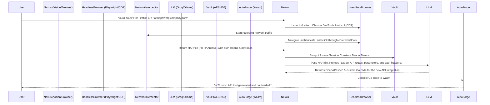

# RFC: UI-to-API Reverse Engineering

## 1. Overview
Current AI agents (like AutoAgent or LangChain tools) rely heavily on existing OpenAPI specifications, documented APIs, or rigid `BeautifulSoup` scrapers to interact with software. If a system (like an old ERP, an undocumented dashboard, or an internal corporate portal) lacks an API, agents fail.

NEXUS will solve this with **UI-to-API Reverse Engineering**. Given a URL, NEXUS autonomously logs in via headless browser, observes the Network tab, reverse-engineers the undocumented API calls, and automatically synthesizes a new native tool integration for it.

## 2. Architecture & Workflow

## 3. Core Components

### 3.1 Headless Exploration (Browser Agent)
Using the Chrome DevTools Protocol (CDP), the NEXUS Browser Agent physically "clicks" through the target application. It uses the **Vision Agent** to understand the DOM layout and identify key action buttons (Submit, Search, Download).

### 3.2 Network Interception
As the Browser Agent interacts with the UI, NEXUS records all underlying `fetch` and `XHR` requests. It captures:
- Request URLs and Methods
- Hidden authentication headers (`Bearer`, `X-CSRF-Token`)
- Request bodies (JSON payloads)
- Response structures

### 3.3 Semantic Extraction (LLM)
NEXUS parses the raw HTTP traffic (HAR data) and sends it to the LLM with instructions to filter out analytics, telemetry, and static assets (images/CSS). The LLM isolates the core functional endpoints and maps out the undocumented API.

### 3.4 Token Storage (AES-256 Vault)
Undocumented APIs usually rely on session cookies or short-lived tokens rather than API keys. NEXUS extracts these from the successful login request and securely stores them in the local encrypted `~/.nexus/vault.db`. It sets up a cron-job to auto-refresh the token via a silent headless login if it expires.

### 3.5 Tool Generation (Auto-Forge)
Using the **Auto-Forge** Wasm engine, NEXUS writes a `.go` script that wraps these newly discovered endpoints into a standard NEXUS Tool. It compiles and hot-loads it. The user can now interact with the legacy ERP using natural language: *"Check my pending invoices in FirstBit."*

## 4. Key Advantages
- **No API Docs Needed**: If a human can click it in a browser, NEXUS can build an API for it.
- **Secure Authentication**: Avoids storing plain-text passwords by capturing and storing the actual session cookies directly into the AES-256 Vault.
- **Resilience**: If the website's DOM changes (which breaks traditional scrapers), the underlying API calls often remain the same, making this approach much more robust than UI scraping.